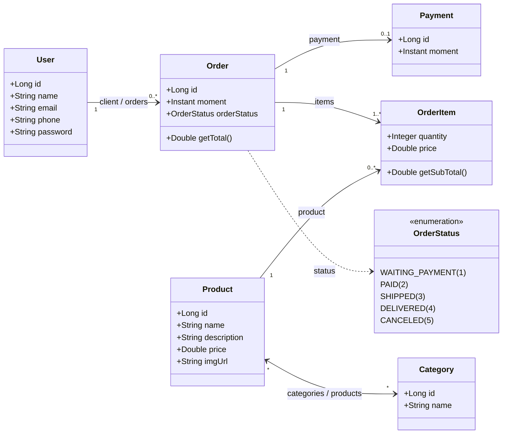

# 🛒 Web Services & E-commerce API com Spring Boot

API RESTful desenvolvida com **Java** e **Spring Boot** para gerenciamento de um domínio de comércio eletrônico (e-commerce), incluindo usuários, pedidos, itens de pedidos, produtos, categorias e pagamentos.

---

## 📌 Sumário
- [Sobre o Projeto e Intenção](#-sobre-o-projeto-e-intenção)
- [Arquitetura e Camadas](#-arquitetura-e-camadas)
- [Modelo de Domínio](#-modelo-de-domínio)
- [Tecnologias Utilizadas](#-tecnologias-utilizadas)
- [Configuração e Execução](#-configuração-e-execução)
- [Banco de Dados H2 Console](#-banco-de-dados-h2-console)
- [Documentação dos Endpoints REST](#-documentação-dos-endpoints-rest)
  - [Usuários (`/users`)](#1-usuários-users)
  - [Pedidos (`/orders`)](#2-pedidos-orders)
  - [Produtos (`/products`)](#3-produtos-products)
  - [Categorias (`/categories`)](#4-categorias-categories)
- [Tratamento de Exceções](#-tratamento-de-exceções)
- [Dados Iniciais de Teste (Seeding)](#-dados-iniciais-de-teste-seeding)
- [Estrutura de Pastas](#-estrutura-de-pastas)

---

## 🎯 Sobre o Projeto e Intenção

### Intenção
A intenção principal deste projeto é fornecer uma base sólida, escalável e bem arquitetada para um sistema de comércio eletrônico, demonstrando as melhores práticas do ecossistema **Spring Boot**:

1. **Separação de Responsabilidades**: Arquitetura estrita em camadas (Controladores REST, Regras de Negócio/Serviços, Acesso a Dados/Repositórios e Entidades de Domínio).
2. **Mapeamento Objeto-Relacional (ORM / JPA / Hibernate)**: Modelagem de relacionamentos relacionais complexos do mundo real:
   - **Um-para-Muitos / Muitos-para-Um**: Usuário com seus Pedidos (`User` 1 -> N `Order`).
   - **Muitos-para-Muitos**: Produtos e Categorias (`Product` N <-> N `Category` com tabela intermediária `tb_product_category`).
   - **Um-para-Um dependente**: Pedido e Pagamento (`Order` 1 <-> 1 `Payment`) com chave primária compartilhada (`@MapsId`).
   - **Associação com Atributos / Chave Composta**: Associação entre Pedido e Produto (`OrderItem`) com quantidade e preço histórico, utilizando chave embutida (`OrderItemPK`).
3. **Regras de Negócio em Tempo de Execução**: Cálculo dinâmico de subtotal (`price * quantity`) e total do pedido sem redundância no banco de dados.
4. **Tratamento Global de Exceções**: Padronização de respostas de erro da API através de `@ControllerAdvice`, garantindo respostas JSON uniformes para recursos não encontrados (`404`) e falhas de integridade referencial (`400`).

---

## 🏛 Arquitetura e Camadas

O projeto adota o padrão de camadas clássico do Spring Boot:

```
           [ Cliente HTTP / Postman / Frontend ]
                            │
                            ▼
              ┌───────────────────────────┐
              │     Resources (API REST)  │  <- Controladores REST (@RestController)
              └─────────────┬─────────────┘
                            │
                            ▼
              ┌───────────────────────────┐
              │      Services Layer       │  <- Regras de Negócio (@Service)
              └─────────────┬─────────────┘
                            │
                            ▼
              ┌───────────────────────────┐
              │    Repositories (JPA)     │  <- Acesso a Dados (Spring Data JPA)
              └─────────────┬─────────────┘
                            │
                            ▼
              ┌───────────────────────────┐
              │  Banco de Dados (H2 / PG) │  <- Persistência Relacional
              └───────────────────────────┘
```

---

## 🧩 Modelo de Domínio

### Entidades e Relacionamentos



---

## 🚀 Tecnologias Utilizadas

- **Java 25**: Recursos modernos da linguagem Java.
- **Spring Boot 4.1.x**:
  - `spring-boot-starter-webmvc`: Criação dos endpoints REST e serialização JSON (Jackson).
  - `spring-boot-starter-data-jpa`: Abstração de persistência com Hibernate.
  - `spring-boot-h2console`: Painel web do banco em memória.
- **H2 Database**: Banco de dados relacional em memória para desenvolvimento e testes ágeis.
- **PostgreSQL Driver**: Dependência já configurada para transição para banco de produção.
- **Maven**: Gerenciamento de dependências e build.

---

## ⚙️ Configuração e Execução

### Pré-requisitos
- **Java JDK 25** (ou compatível com a versão configurada no `pom.xml`)
- Maven (ou utilizar o wrapper incluso `./mvnw` / `mvnw.cmd`)

### Como Executar

1. Clone o repositório ou abra a pasta do projeto no seu terminal:
   ```bash
   cd project
   ```

2. Execute o projeto usando o **Maven Wrapper**:
   - **Linux / macOS**:
     ```bash
     ./mvnw spring-boot:run
     ```
   - **Windows (PowerShell / CMD)**:
     ```powershell
     .\mvnw.cmd spring-boot:run
     ```

3. O servidor iniciará por padrão na porta **`8081`**:
   - URL Base: `http://localhost:8081`

---

## 🗄 Banco de Dados H2 Console

Quando executado com o profile padrão (`test`), o banco de dados em memória **H2** fica ativo e pode ser inspecionado via navegador:

- **URL de Acesso**: `http://localhost:8081/h2-console`
- **JDBC URL**: `jdbc:h2:mem:testdb`
- **User Name**: `sa`
- **Password**: *(deixe em branco)*

---

## 📡 Documentação dos Endpoints REST

### 1. Usuários (`/users`)
Gerencia o cadastro de clientes do sistema com operações CRUD completas.

| Método | Endpoint | Descrição | Status Sucesso |
| :--- | :--- | :--- | :--- |
| `GET` | `/users` | Lista todos os usuários | `200 OK` |
| `GET` | `/users/{id}` | Busca um usuário por ID | `200 OK` |
| `POST` | `/users` | Cadastra um novo usuário | `201 Created` |
| `PUT` | `/users/{id}` | Atualiza dados de um usuário | `200 OK` |
| `DELETE` | `/users/{id}` | Remove um usuário | `204 No Content` |

#### Exemplos de Requisição e Resposta

- **`GET /users/1`**:
  ```json
  {
    "id": 1,
    "name": "Maria Brown",
    "email": "maria@gmail.com",
    "phone": "988888888",
    "password": "123456"
  }
  ```

- **`POST /users`**:
  *Corpo da Requisição (JSON):*
  ```json
  {
    "name": "Carlos Silva",
    "email": "carlos@gmail.com",
    "phone": "999991111",
    "password": "segredo123"
  }
  ```
  *Resposta:* `201 Created` com cabeçalho `Location: http://localhost:8081/users/3`

- **`PUT /users/1`**:
  *Corpo da Requisição (JSON):*
  ```json
  {
    "name": "Maria Brown Alterada",
    "email": "maria_nova@gmail.com",
    "phone": "911112222"
  }
  ```

- **`DELETE /users/1`**:
  *Resposta:* `204 No Content` (ou `400 Bad Request` caso o usuário possua pedidos associados, protegendo a integridade do banco).

---

### 2. Pedidos (`/orders`)
Consulta os pedidos realizados, incluindo cliente associado, itens comprados, cálculo de subtotal/total e status de pagamento.

| Método | Endpoint | Descrição | Status Sucesso |
| :--- | :--- | :--- | :--- |
| `GET` | `/orders` | Lista todos os pedidos cadastrados | `200 OK` |
| `GET` | `/orders/{id}` | Busca detalhes completos de um pedido | `200 OK` |

#### Exemplo de Resposta de Pedido (`GET /orders/1`):
```json
{
  "id": 1,
  "moment": "2019-06-20T19:53:07Z",
  "orderStatus": "PAID",
  "client": {
    "id": 1,
    "name": "Maria Brown",
    "email": "maria@gmail.com",
    "phone": "988888888"
  },
  "items": [
    {
      "quantity": 2,
      "price": 90.5,
      "product": {
        "id": 1,
        "name": "The Lord of the Rings",
        "description": "Lorem ipsum dolor sit amet, consectetur.",
        "price": 90.5,
        "imgUrl": ""
      },
      "subTotal": 181.0
    },
    {
      "quantity": 1,
      "price": 1250.0,
      "product": {
        "id": 3,
        "name": "Macbook Pro",
        "description": "Nam eleifend maximus tortor, at mollis.",
        "price": 1250.0,
        "imgUrl": ""
      },
      "subTotal": 1250.0
    }
  ],
  "payment": {
    "id": 1,
    "price": "2019-06-20T21:53:07Z"
  },
  "total": 1431.0
}
```

> **Nota**: O campo `total` é calculado dinamicamente em memória somando os `subTotal` de cada item.

---

### 3. Produtos (`/products`)
Consulta catálogo de produtos com suas categorias vinculadas.

| Método | Endpoint | Descrição | Status Sucesso |
| :--- | :--- | :--- | :--- |
| `GET` | `/products` | Lista todos os produtos | `200 OK` |
| `GET` | `/products/{id}` | Busca produto por ID com suas categorias | `200 OK` |

#### Exemplo de Resposta (`GET /products/2`):
```json
{
  "id": 2,
  "name": "Smart TV",
  "description": "Nulla eu imperdiet purus. Maecenas ante.",
  "price": 2190.0,
  "imgUrl": "",
  "categories": [
    {
      "id": 1,
      "name": "Eletronics"
    },
    {
      "id": 3,
      "name": "Computers"
    }
  ]
}
```

---

### 4. Categorias (`/categories`)
Consulta as categorias cadastradas para classificação de produtos.

| Método | Endpoint | Descrição | Status Sucesso |
| :--- | :--- | :--- | :--- |
| `GET` | `/categories` | Lista todas as categorias | `200 OK` |
| `GET` | `/categories/{id}` | Busca categoria por ID | `200 OK` |

#### Exemplo de Resposta (`GET /categories/1`):
```json
{
  "id": 1,
  "name": "Eletronics"
}
```

---

## 🛡 Tratamento de Exceções

O projeto possui um interceptador global de erros (`ResourceExceptionHandler` com `@ControllerAdvice`) que formata exceções em um padrão consistente (`StandardError`).

### 1. Recurso Não Encontrado (`ResourceNotFoundException`)
Disparado ao consultar, atualizar ou deletar um ID inexistente.
- **HTTP Status**: `404 Not Found`
- **Exemplo de Resposta**:
  ```json
  {
    "timestamp": "2026-10-02T12:58:30Z",
    "status": 404,
    "error": "Resource not found",
    "message": "Resource not found. Id 999",
    "path": "/users/999"
  }
  ```

### 2. Violação de Integridade (`DatabaseException`)
Disparado ao tentar excluir um recurso que possui vínculos em outras tabelas (ex.: tentar excluir um usuário que possui pedidos associados).
- **HTTP Status**: `400 Bad Request`
- **Exemplo de Resposta**:
  ```json
  {
    "timestamp": "2026-10-02T12:59:00Z",
    "status": 400,
    "error": "Database error",
    "message": "Referential integrity constraint violation...",
    "path": "/users/1"
  }
  ```

---

## 🌱 Dados Iniciais de Teste (Seeding)

Ao iniciar a aplicação com o perfil `test` ativo, a classe `TestConfig` (`CommandLineRunner`) popula automaticamente o banco em memória com:

- **3 Categorias**: `Eletronics`, `Books`, `Computers`
- **5 Produtos**: `The Lord of the Rings`, `Smart TV`, `Macbook Pro`, `PC Gamer`, `Rails for Dummies`
- **2 Usuários**: `Maria Brown` e `Alex Green`
- **3 Pedidos**: com itens, status (`PAID`, `WAITING_PAYMENT`) e 1 pagamento efetuado.

---

## 📁 Estrutura de Pastas

```
src/main/java/com/spring/project/
├── config/
│   └── TestConfig.java                     # Carga inicial de dados para testes
├── entities/
│   ├── Category.java                       # Entidade Categoria
│   ├── Order.java                          # Entidade Pedido
│   ├── OrderItem.java                      # Entidade Item do Pedido (N:N com dados)
│   ├── Payment.java                        # Entidade Pagamento
│   ├── Product.java                        # Entidade Produto
│   ├── User.java                           # Entidade Usuário/Cliente
│   ├── enums/
│   │   └── OrderStatus.java                # Enum de status do pedido
│   └── pk/
│       └── OrderItemPK.java                # Chave primária composta do OrderItem
├── repositories/
│   ├── CategoryRepository.java             # Acesso a dados de Categorias
│   ├── OrderItemRepository.java            # Acesso a dados de Itens do Pedido
│   ├── OrderRepository.java                # Acesso a dados de Pedidos
│   ├── ProductRepository.java              # Acesso a dados de Produtos
│   └── UserRepository.java                 # Acesso a dados de Usuários
├── resources/
│   ├── CategoryResource.java               # Endpoints REST de Categorias
│   ├── OrderResource.java                  # Endpoints REST de Pedidos
│   ├── ProductResource.java                # Endpoints REST de Produtos
│   ├── UserResource.java                   # Endpoints REST de Usuários
│   └── exceptions/
│       ├── ResourceExceptionHandler.java  # Interceptador global de exceções
│       └── StandardError.java              # Payload padrão de resposta de erro
├── services/
│   ├── CategoryService.java                # Regras de negócio de Categorias
│   ├── OrderService.java                   # Regras de negócio de Pedidos
│   ├── ProductService.java                 # Regras de negócio de Produtos
│   ├── UserService.java                    # Regras de negócio de Usuários
│   └── exceptions/
│       ├── DatabaseException.java          # Exceção de erro de banco
│       └── ResourceNotFoundException.java  # Exceção de entidade não encontrada
└── ProjectApplication.java                 # Classe principal do Spring Boot
```
